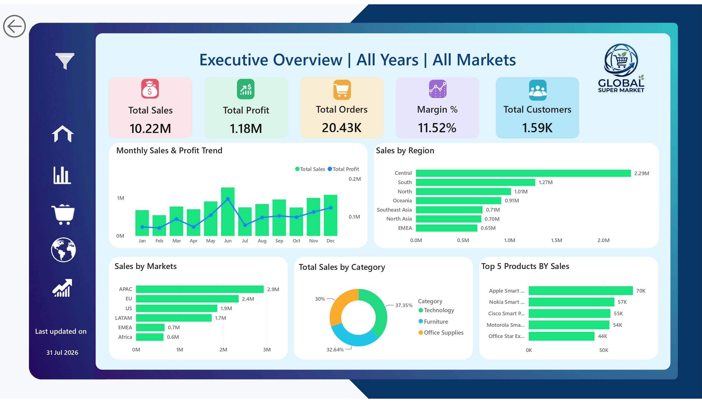
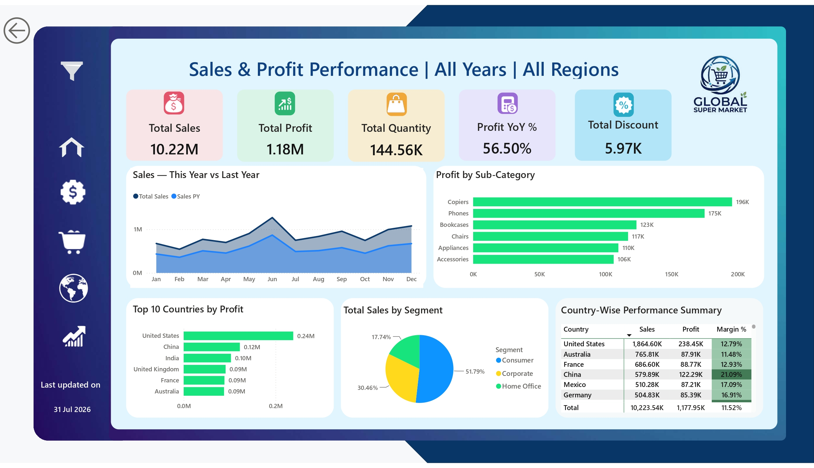
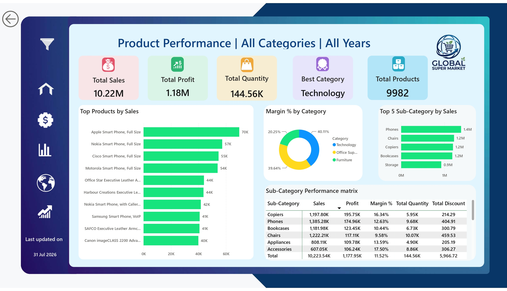
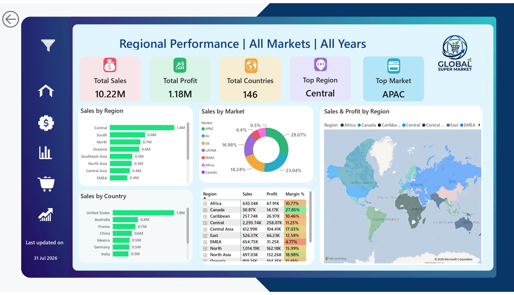
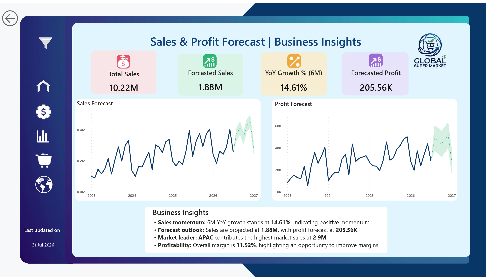

# Retail Sales Analysis | Power BI

## Project Overview

This project presents an end-to-end retail sales analysis developed in Microsoft Power BI. The objective is to transform retail transaction data into a business-focused analytical solution that enables stakeholders to monitor sales performance, profitability, product performance, regional trends, and future performance.

The dashboard is designed to support data-driven decision-making by providing interactive KPIs, trend analysis, comparative performance views, and forecasting.

## Business Objectives

* Monitor overall sales and profitability performance
* Identify sales and profit trends over time
* Evaluate product and category performance
* Analyze regional sales and profitability
* Identify key business drivers and underperforming areas
* Support performance monitoring through interactive reporting
* Analyze expected future sales and profit trends

## Tools & Technologies

* Microsoft Power BI
* Power Query
* DAX
* Data Modeling
* Interactive Data Visualization
* GitHub

## Dashboard

### Executive Overview

Provides a consolidated view of key business KPIs and overall sales and profitability performance.



### Sales & Profit Performance

Analyzes sales and profit trends over time and provides a comparative view of business performance.



### Product Performance

Evaluates product-level sales and profitability to identify high-performing and underperforming products.



### Regional Performance

Analyzes sales and profitability across regions to identify geographical performance patterns.



### Sales & Profit Forecast

Provides a forward-looking view of expected sales and profit performance based on historical trends.



## Analytical Approach

### Data Preparation

* Cleaned and transformed source data using Power Query
* Handled data types and missing values
* Prepared analytical fields required for reporting
* Structured the dataset for efficient Power BI analysis

### Data Modeling

* Developed a structured data model for analytical reporting
* Established relationships between relevant tables
* Created calculated measures using DAX
* Designed reusable KPIs for dashboard reporting

### Analysis

The analysis focuses on:

* Sales performance
* Profitability
* Product performance
* Regional performance
* Time-based trends
* Customer performance
* Forecasting

## Key Metrics

The dashboard tracks core business performance indicators including:

* Total Sales
* Total Profit
* Sales Growth
* Profit Growth
* Product Performance
* Regional Performance
* Sales Trends
* Profit Trends
* Forecasted Sales
* Forecasted Profit

## Key Insights

The dashboard enables stakeholders to:

* Identify major contributors to revenue and profitability
* Compare product and regional performance
* Detect changes in sales and profit trends
* Identify areas requiring further investigation
* Evaluate historical performance against forecasted results

## Repository Structure

```text
Retail-sales-PowerBI/
│
├── images/
│   ├── executive-overview.jpg
│   ├── sales-profit-performance.jpg
│   ├── product-performance.jpg
│   ├── regional-performance.jpg
│   └── sales-profit-forecast.jpg
│
├── Retail_sales_Globalsupermarket.Report/
├── Retail_sales_Globalsupermarket.SemanticModel/
├── Retail_sales_Globalsupermarket.pbip
├── .gitignore
└── README.md
```

## Project Outcome

This project demonstrates the application of Power BI for converting raw retail data into a structured business intelligence solution. It combines data preparation, data modeling, DAX-based calculations, visualization, performance analysis, and forecasting within a single reporting environment.

## Author

Naveen Nallathambi

GitHub: https://github.com/naveennallathambi22
